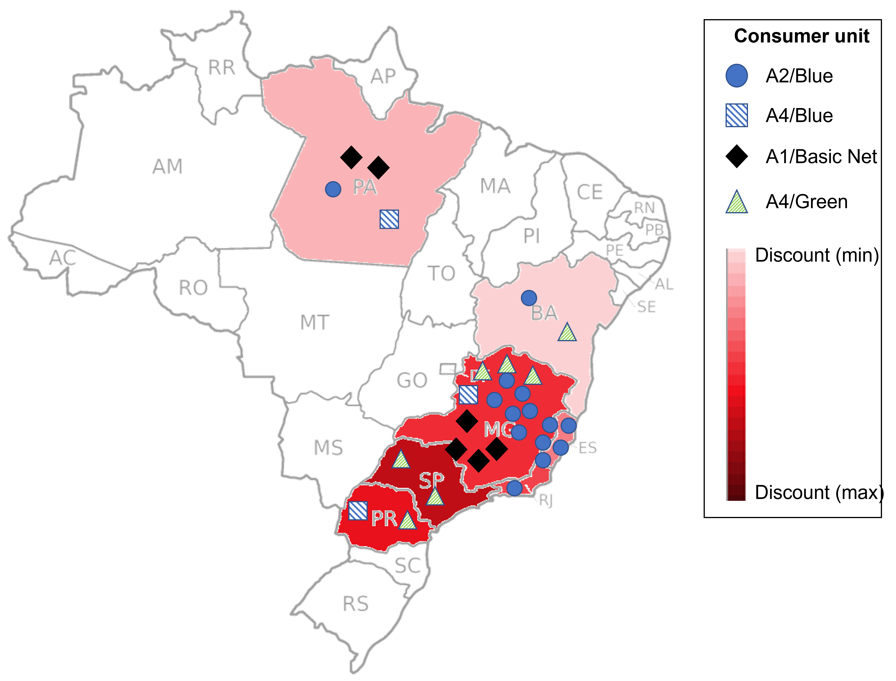
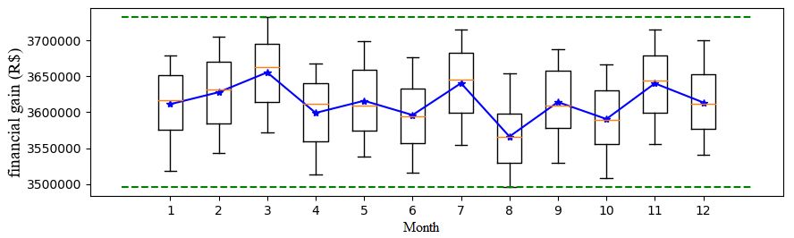

# A novel optimization tool for allocation of self-generated energy

paper: [https://doi.org/10.55905/rcssv12n2-024](https://doi.org/10.55905/rcssv12n2-024)

The main contributions of this work are: (i) the elaboration of the allocation of self-generated mechanism as an optimization problem; (ii) development of a free tool that provides the values to be allocated to each consumer unit in order to obtain the greatest gain with the distribution of the agent's generation and (iii) enable an allocation analysis to obtain the predictability of earnings with allocation in a given future period.

## Study case
Consumer units of a company (December/2019) relative to the study case

Annual financial gain (2020) with optimized allocation of self-generated energy

## Program

Once you click on the file optimization4allocation.exe, you should be able to launch your program (if you get an error message, you may need to install [Visual C++ Redistributable](https://support.microsoft.com/en-ca/help/2977003/the-latest-supported-visual-c-downloads).

## Cite us

de Lima, L. M. V. M., Marques, C. M. V., Machado, P. H. F., & Freitas, E. J. de R. (2023). Optimized allocation of self-generated energy: a case study of a brazilian company. Revista Caribeña De Ciencias Sociales, 12(2), 859–876. https://doi.org/10.55905/rcssv12n2-024
